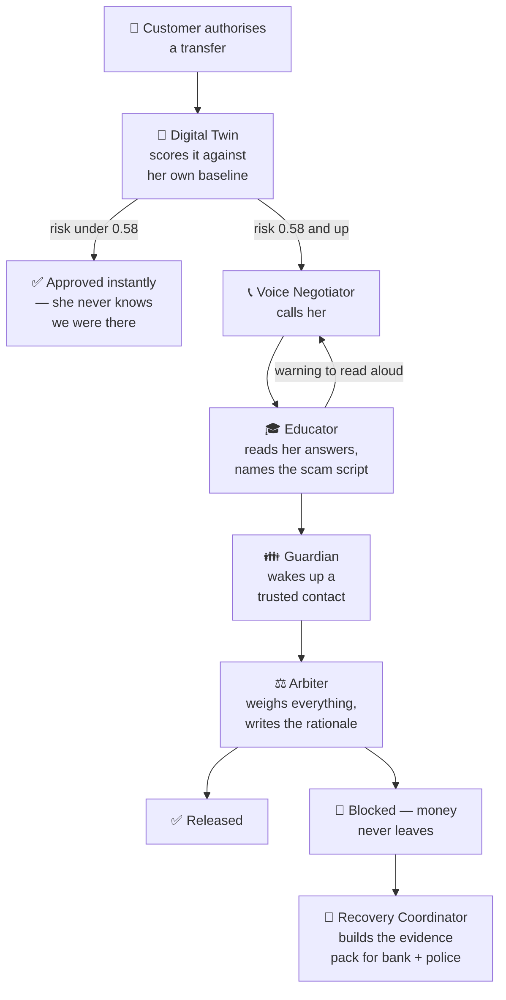

<div align="center">


### The intervention layer for authorised payment fraud

**A scammer doesn't break into the bank. They talk your mother into wiring the money herself.
HyperGuard is the AI swarm that picks up the phone in the sixty seconds before she sends it.**

[](https://langchain-ai.github.io/langgraph/)
[](https://www.twilio.com)
[](https://elevenlabs.io)
[](https://supabase.com)
[](https://hyperguard-production.up.railway.app/docs)

*Detection tells you **after**. HyperGuard intervenes **during**, and helps recover **after**.*

</div>

---

## The idea in 30 seconds

Every fraud system a bank owns is built to answer one question: *is this transaction legitimate?* For modern scams, the answer is always yes. The password was right. The device was recognised. The victim tapped Send with her own thumb, because a man claiming to be the police spent forty minutes convincing her she had to.

HyperGuard asks a different question: **is this person being manipulated right now?**

The moment a transfer looks nothing like the customer's normal behaviour, five agents move at once. One calls her. One listens to her answers and recognises which scam script she's being read from. One wakes up her son. And the money stays in the account until a decision with a written rationale says otherwise.

> ### Our mission
> **Put a defender in the room at the exact moment someone is about to be robbed.**

---

## Why this matters right now

The attack surface stopped being the system and became the person, and the industry's tooling hasn't caught up.

- **Roughly 94% of fraud losses are payments the victim authorised themselves.** Nothing was stolen — it was given. Every control that checks credentials, devices, or account takeover signals waves these straight through.
- **The whole scam lives inside a sixty-second window** — between *"I'll send it"* and *"sent."* No human fraud team can be inside that window for every customer, on every transfer, at 2am.
- **The existing shields report; they don't intervene.** Tools like Singapore's ScamShield are excellent at detection and reporting, which happen *after* the money has moved. Nobody is doing real-time voice intervention, live scam classification, family escalation, and recovery orchestration as one loop.

Blocking the transfer outright isn't the answer either — it fails the customer and never explains why. The victim needs to *understand* they're being scammed while it's still reversible. That takes a conversation, and a conversation at that scale takes agents.

---

## Watch it work

Seeded scenarios run through the full swarm on a fresh clone with **zero API keys configured** — every external dependency degrades to a deterministic in-process simulation, so the orchestration is provable before anything is wired up. Two of the four, verbatim:

```console
$ python seed.py

HyperGuard smoke test, capabilities: {'llm': False, 'telephony': False, 'speech': False,
                                      'persistence': False, 'distributed_bus': False,
                                      'demo_mode': True}

──────────────────────────────────────────────────────────────────────────────
  scenario   police_impersonation
  customer   May Tan  ·  SGD 8,000 → Quik Holdings Pte Ltd
  risk       99%  (critical)
  scam       Government / Police Impersonation
  decision   BLOCK
  guardians  1 alerted
  evidence   built
  narrative  Blocked. The SGD 8,000 transfer to Quik Holdings Pte Ltd was halted
             after the call surfaced Government / Police Impersonation; Marcus Tan
             was alerted. The money never left the account, and a recovery evidence
             package was prepared for reporting the beneficiary.
──────────────────────────────────────────────────────────────────────────────
  scenario   legitimate_transfer
  customer   May Tan  ·  SGD 280 → NTUC FairPrice
  risk       7%  (minimal)
  scam       —
  decision   APPROVE
  guardians  0 alerted
  evidence   n/a
  narrative  Approved. The SGD 280 transfer to NTUC FairPrice matched May's
             established behaviour with no scam indicators, released without
             interruption.
──────────────────────────────────────────────────────────────────────────────
```

The grocery run clears in milliseconds and nobody is ever called. That restraint is the product: an intervention layer that fires on everything is a layer banks switch off.

---

## How it works

Five agents on a LangGraph state machine. Nodes are agents; edges are conditional transitions on `risk_score`, `verification_status` and `scam_detected`. A single shared state object carries the transaction, the customer's behavioural profile, the risk assessment, the live transcript, the scam classification, the verdict and the evidence through the graph.



### 🧬 Digital Twin — knows what normal looks like

Every customer carries a behavioural baseline: typical amounts, known payees, active hours, transfer velocity. Each incoming transfer is scored against *her* history, not a population average, and the signals combine through a logistic link into a 0–1 risk score.

The weights are legible constants, not a black box. A first-ever payee contributes the most evidence (it is the single strongest predictor of authorised-push fraud); an amount several σ above her normal, off-hours activity, a velocity burst, an overseas number, and coercion vocabulary in the transfer note all stack on top. Below **0.58** the transfer clears silently. At **0.88** it is held pending human confirmation regardless of what the call finds.

This is deliberately not a deep model. At the moment of intervention the *explanation* matters as much as the number — the customer on the phone needs to hear why, and an investigator needs to read it six months later.

### 📞 Voice Negotiator — makes the call

The instant risk crosses the threshold, an outbound call is placed via Twilio with an ElevenLabs voice. It isn't an IVR reading a warning; it conducts contextual verification — *who asked you to send this, what did they say would happen if you didn't* — and streams the transcript back into the graph turn by turn. When telephony credentials are live the conversation runs out-of-band over voice webhooks; when they aren't, the same dialogue plays out deterministically in-process.

### 🎓 Educator — names the script she's being read from

Scams are not improvised. They run from a small number of scripts, and each one has a tell. The Educator classifies the live transcript against six archetypes — **government/police impersonation, bank impersonation, investment/crypto, romance, job/task, and tech support** — and feeds the counter-line straight back into the call for the Negotiator to say aloud. For police impersonation, that's the sentence no real agency ever crosses: *we will never ask you to move money to a safe account.*

Naming the script is what breaks it. A generic "this may be a scam" warning is easy for a victim mid-manipulation to dismiss. Being told exactly what the person on the other line is about to say next is not.

### 👪 Guardian — brings in someone she trusts

Some victims cannot be talked down by a stranger, especially one calling from the bank when a "policeman" has just told them the bank is compromised. The Guardian escalates to pre-authorised trusted contacts with the transaction context and the risk rationale, adding a human verification layer exactly where it's needed most.

### 📁 Recovery Coordinator — for when it's already too late

When fraud has already been processed, the swarm runs a different path entirely and assembles an evidence package: transaction trail, the risk signals that fired, the full conversation log, and the beneficiary details, formatted for the bank's recovery team and law enforcement. Speed is everything in fund recovery, and this turns a multi-day paperwork exercise into one click.

**⚖️ And the Arbiter decides.** It weighs the risk score, the verification status and the scam classification into a single verdict with a written rationale attached. Every decision the swarm makes is explainable and audited — which is the only way a layer like this ever passes a bank's compliance review.

---

## Three surfaces, one swarm

| | | |
|---|---|---|
| 🖥️ **Control centre** | `frontend/` | The bank's mission control. Live risk meters, streaming transcripts, the agent relay firing in real time, every case filed with its full decision trail. Next.js, with a bespoke "interdiction console" design system, a React-Three-Fiber hero and GSAP scroll choreography. |
| 📱 **Wallet** | `mobile/` | The customer's side. A working Expo banking app — balances, payees, transfers, next-of-kin — so the swarm has real transactions to act on. Send money to the hidden scam payee and watch the intervention land on your own phone. |
| ⚙️ **Swarm** | `backend/` | FastAPI + LangGraph. REST, WebSocket event stream, wallet and admin APIs, and the five agents. [Live on Railway →](https://hyperguard-production.up.railway.app/docs) |

---

## Try it yourself

```bash
git clone https://github.com/basil-boh/HyperGuard-.git && cd HyperGuard-
cp infra/.env.example .env        # optional — it runs without any of it
```

**Backend** — the swarm, and a one-command proof it's wired correctly:

```bash
cd backend
python -m venv .venv && source .venv/bin/activate
pip install -r requirements.txt

python seed.py                    # run every scenario through the full swarm
pytest                            # risk engine · swarm · wallet
uvicorn app.main:app --reload --port 8000
```

**Control centre** — `cd frontend && npm install && npm run dev` → [localhost:3000](http://localhost:3000)

**Wallet** — bind the backend to your LAN first (`uvicorn app.main:app --host 0.0.0.0 --port 8000`), then `cd mobile && npm install && npx expo start` and open it in Expo Go. The app auto-discovers the backend from the Expo dev host, so there is nothing to configure on the phone. See [mobile/README.md](./mobile/README.md) for the demo script.

### Keys, and what happens without them

Every external dependency is capability-gated. Absent a credential, that subsystem degrades to a deterministic simulation and the swarm still runs end to end — you can see the whole thing work before signing up for anything.

| Key | What it buys you | Needed? |
|---|---|---|
| `OPENAI_API_KEY` | LLM dialogue and the risk explainer | Recommended. Without it, scripted dialogue and template explanations. |
| `TWILIO_ACCOUNT_SID` / `TWILIO_AUTH_TOKEN` / `TWILIO_PHONE_NUMBER` | places a real outbound call | Optional. Without it, the conversation runs in-process. |
| `ELEVENLABS_API_KEY` | the negotiator's voice | Optional. Falls back to Twilio's Polly TTS. |
| `SUPABASE_URL` / `SUPABASE_SERVICE_KEY` | cases and transcripts survive a restart | Optional. Without it, in-memory. |
| `REDIS_URL` | distributed event bus across workers | Optional. Without it, an in-process bus. |
| `AUTH_SECRET` | signs customer session tokens | Local: no. Deployed: yes, or every restart signs everyone out. |

<details>
<summary><b>Project layout and the developer contract</b></summary>

```
backend/                       # FastAPI + LangGraph
  app/
    graph.py                   # the swarm orchestrator — nodes, routers, shared state
    config.py                  # capability gating: every integration optional
    agents/                    # digital_twin · negotiator · educator · guardian · recovery · arbiter
    services/                  # risk_engine · scam_taxonomy · dialogue · baselines · llm · auth
    integrations/              # voice (Twilio/ElevenLabs) · notifications · event bus · persistence
    api/                       # routes · ws · auth · wallet (customer) · admin (console) · twilio_voice
    wallet/                    # multi-account bank: accounts, cases, payee registry
    data/seed_data.py          # demo personas & scenarios
  db/schema.sql                # Postgres schema
  tests/                       # risk engine · end-to-end swarm · wallet · auth
  seed.py                      # one-command smoke test

frontend/                      # Next.js — the bank's CONTROL CENTRE
  app/console/                 # overview · users/[id] · cases/[id] · live
  components/                  # landing (Hero3D · ScrollStory) · control · console (RiskMeter · TranscriptStream)

mobile/                        # Expo — the CUSTOMER's banking app
  app/                         # Wallet · Activity · Guardians · transfer · intervention
  components/                  # AgentRelay · RiskGauge · Transcript

infra/                         # .env.example · Supabase schema
```

The entire swarm is one call. Everything else — the REST API, the WebSocket stream, the wallet — is a caller.

```python
from app.graph import get_orchestrator

outcome = await get_orchestrator().run(customer, txn)

outcome.decision          # Decision.approve | Decision.block
outcome.risk              # score, band, and every signal that fired, with reasons
outcome.classification    # which scam archetype, and how confident
outcome.transcript        # the conversation, turn by turn
outcome.guardian_alerts   # who was contacted, and what they were told
outcome.evidence          # the recovery package, when one was needed
outcome.narrative         # the whole thing in plain English
```

</details>

---

## Where we're taking HyperGuard

Today HyperGuard is a complete, demonstrable swarm running against a simulated bank. The path to production is about depth, not new ideas.

- **Live rails.** The telephony, voice and LLM paths are capability-gated and already wired — flipping the keys on places a real call. Next is hardening that path against real conversation: interruptions, dialect, hostility, and the scammer still being on the other line.
- **Durable recovery.** Recovery is the one flow that genuinely outlives a process — evidence gathering, bank submission, police reporting, status chasing. That belongs in Temporal, not in memory.
- **A twin that learns.** Today's baselines are computed from transaction history with legible weights. The next version updates continuously and learns what an *intervention* taught us about that customer — including the ones we called and shouldn't have.
- **The layer, not the app.** The end state isn't a banking app; it's a drop-in layer between intent and settlement that any bank or wallet can put in front of a transfer, with no rip-and-replace of their stack.

> **[plan.md](./plan.md)** has the full build plan — data model, phase timeline, and the orchestration decisions with their trade-offs written down.
> **[PRESENTATION.md](./PRESENTATION.md)** is the live demo script; **[PITCH.md](./PITCH.md)** is the forty-second version.

---

## Disclaimer

HyperGuard is a prototype built for demonstration. It is **not** a production financial-security system and is not connected to real banking or payment rails. Do not use it to make real fraud-prevention decisions without appropriate review, testing, and compliance sign-off. The seeded personas, transactions and scam payees are fictional.

---

<div align="center">


**Detection tells you *after*. HyperGuard intervenes *during*.**

Built with 🧬 [LangGraph](https://langchain-ai.github.io/langgraph/) &nbsp;·&nbsp; 📞 [Twilio](https://www.twilio.com) &nbsp;·&nbsp; 🎙️ [ElevenLabs](https://elevenlabs.io) &nbsp;·&nbsp; 🗄️ [Supabase](https://supabase.com) &nbsp;·&nbsp; ⚡ [FastAPI](https://fastapi.tiangolo.com) &nbsp;·&nbsp; ▲ [Next.js](https://nextjs.org)

</div>
