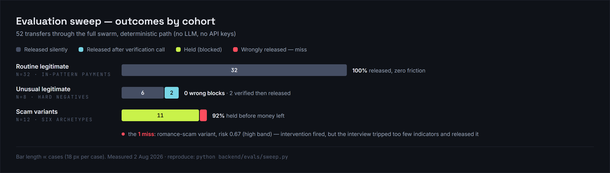
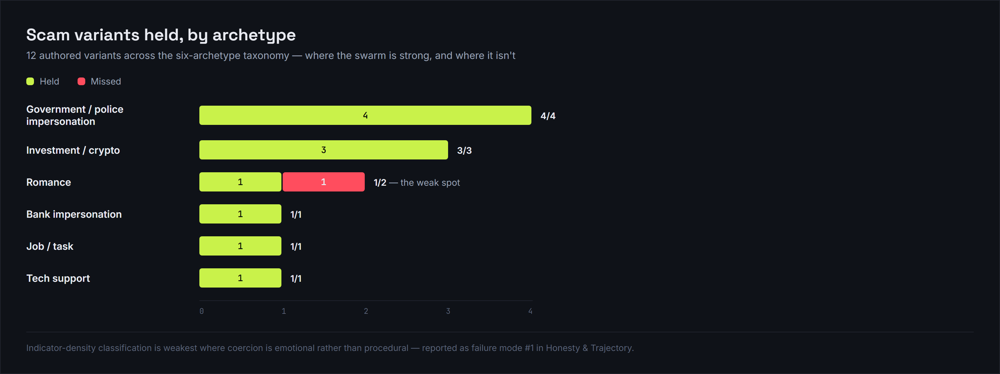
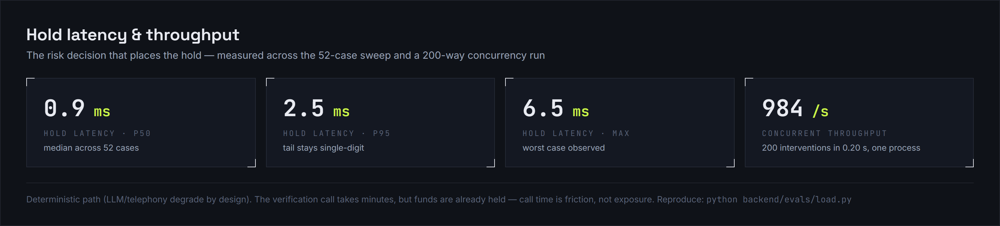

# HyperGuard — Autonomous Fraud Intervention Swarm

*LaunchPad 2026 AI Challenge · Applications track · Team HyperGuard*

## Problem

Singapore lost S$913.1 million to scams in 2025, and 81.8% of cases involved **self-effected transfers**: the scammer never touched the account — they talked the victim into paying (SPF, 2025). This is the failure mode existing tools cannot reach. ScamShield blocks known scam calls, filters SMS, and checks suspicious links — a **pre-contact filter**. An authorised-push-payment scam survives it: once the fake "police officer" has convinced the victim, there is no message left to block; the victim opens their own banking app and presses send. Banks typically act after settlement, once funds have dispersed through mule accounts.

Nor is this an "elderly problem": 85.2% of 2025 victims were under 65, with adults 30–49 the largest cohort — while seniors lost the most per victim. Government impersonation hits retirees; investment, job-task and romance scams hit working adults and students.

Success criteria, defined before building: (1) a high-risk transfer is **held before money leaves**, not reported after; (2) every decision carries an explanation a customer — and a regulator — can read; (3) legitimate traffic is not wrongly blocked, with friction measured, not assumed; (4) protection keeps working when every external API is down.

## Approach

HyperGuard is a multi-agent swarm embedded in the bank's payment flow, orchestrated as a LangGraph state machine. Per transfer: a **Digital Twin** scores risk against that customer's own behavioural baseline (eight weighted signals — new payee, amount z-score, velocity, off-hours, coercion language — combined through a logistic link with per-signal contribution shares). Above threshold, a **Voice Negotiator** phones the customer mid-transfer; an **Educator** classifies the scam archetype live from the customer's own words against a six-archetype indicator taxonomy and debriefs them by quoting their own sentences back; a **Guardian** alerts next-of-kin by SMS; an **Arbiter** approves or holds; a **Recovery** agent assembles a bank-ready evidence dossier.

Decisions made, alternatives ruled out:

- **Deterministic risk engine, not ML.** No labelled training data exists at this scale, and an unexplainable score is unusable in banking; per-signal contributions give honest explainability.
- **LLM advisory, never safety-critical.** Ruled out "the LLM decides": scammers coach victims, so a promptable judge is an attack surface, and an outage would disable protection. Every LLM call (dialogue phrasing, post-call adjudication, incident report) has a deterministic fallback; scam guidance is delivered verbatim from the authored taxonomy, never generated.
- **Point of payment, not point of contact.** Ruled out rebuilding ScamShield's message filtering; HyperGuard is the layer behind it — the last line once social engineering has already succeeded.
- **Build vs use.** Used: Twilio (voice + SMS), OpenAI, ElevenLabs, Supabase, Redis, LangGraph, Next.js, Expo. Built: the risk engine, scam taxonomy, victim simulator, orchestration and bank sandbox — the components carrying the safety argument, which had to stay auditable.
- **Capability gating.** Every integration is optional; with zero keys the full swarm runs deterministically end-to-end, so the demo, tests and evaluation are hermetic and reproducible.

## Evidence

Scoped honestly: all numbers below come from authored scenario suites with simulated victims on the deterministic path (no LLM), reproducible with no API keys (Appendix A). We have not yet tested with real users.

- Automated suite: **12/12 tests pass**, including four end-to-end swarm scenarios.
- 52-case evaluation sweep — 32 routine legitimate, 8 unusual-but-legitimate hard negatives (new payees, off-hours, 4–7× baseline amounts), 12 scam variants spanning all six archetypes and two customer profiles: **11/12 scams held** (92% detection); **40/40 legitimate transfers released** (zero wrong blocks); friction cost measured at 2/40 legitimate cases (5%, both hard negatives) receiving a verification call before release.
- The miss is instructive: a romance-scam variant scored 0.67 (high band — intervention fired) yet was released after the interview because the victim's answers tripped too few taxonomy indicators. Detailed under Honesty.
- The live path works end-to-end: real Twilio call with a speech interview, LLM adjudication, guardian SMS and incident report persisted to the case (shown in the demo video).

## Constraints

- **Latency.** The step that matters — placing the hold — measured p50 0.9 ms, p95 2.5 ms, max under 7 ms across the sweep. The verification call takes minutes, but funds are already held; call time is customer friction, not exposure.
- **Unit economics.** Deterministic path: effectively zero marginal cost. Live intervention: estimated US$0.15–0.35 (2–3 min Twilio call, guardian SMS, ~10k LLM tokens — a price-sheet estimate, not measured billing). Against typical four-to-five-figure APP-scam losses the margin is enormous; the binding economic constraint is false-positive call volume, which the friction measurement above (5% on hard negatives, 0% on routine traffic) tracks directly.
- **Reliability under load.** 200 concurrent interventions completed in under 0.25 s (>800/s in a single laptop process). Degradation is designed, not accidental: LLM down → deterministic dialogue and heuristic adjudication; Twilio down → simulated interview; Redis/Supabase down → in-process bus and in-memory store.
- **Safety bias.** At ≥0.88 risk the arbiter holds even when the interview is inconclusive — we accept friction over loss, and measured what that friction costs.

## Honesty & Trajectory

Where it breaks: (1) the romance miss — indicator-density classification is weakest where coercion is emotional rather than procedural; (2) simulator circularity — victim scripts derive from the same taxonomy that classifies them, so real victims will phrase things our indicators miss; (3) the voice interview is three fixed questions, not free conversation (streaming transcription is a documented seam, not built); (4) the "filed with authorities" step is synthetic — no real police API exists; (5) authentication lives on an unmerged branch, so mainline APIs are currently open; (6) no user testing yet, and cost figures are estimates.

Next, in order: merge auth; guardian co-approval (two-key transfers); a rehearsal mode reusing the victim simulator as inoculation training across age groups; age-cohort scam priors and younger personas; streaming call transcription; measured billing; then a usability study with a seniors' community group and a bank sandbox pilot.

---

## Appendix A — Reproducing every number (no API keys required)

```bash
cd backend
python -m venv .venv && .venv/Scripts/pip install -r requirements.txt   # or bin/ on Unix
.venv/Scripts/python -m pytest tests/ -q     # 12/12
.venv/Scripts/python evals/sweep.py          # 52-case sweep: detection, wrong blocks, friction, latency
.venv/Scripts/python evals/load.py           # 200 concurrent interventions
.venv/Scripts/python seed.py                 # narrated end-to-end smoke run of all scenarios
```

The eval scripts force `FORCE_DEMO_MODE=true` and blank all credential env vars before importing the app, so they are hermetic even on a machine with a populated `.env`.

## Appendix B — Evaluation results

**Figure 1 — Sweep outcomes by cohort.** All 40 legitimate transfers released (2 after a verification call); 11/12 scams held.



**Figure 2 — Detection by archetype.** Procedural-coercion scams (government, bank, investment, job, tech-support) all held; the single miss is a romance variant — the emotional-coercion weak spot reported in Honesty & Trajectory.



**Figure 3 — Hold latency and throughput.** The hold is placed in single-digit milliseconds; the verification call happens after funds are already frozen.



**Verbatim sweep output:**

```
cases: 52
  legit_routine  n= 32  {'approve': 32}
  legit_unusual  n=  8  {'approve': 6, 'approve+intervened': 2}
  scam           n= 12  {'block+intervened': 11, 'approve+intervened': 1}

decision latency ms: p50=0.9 p95=2.5 max=6.5

wrong decisions (1):
   ('scam', 'cust_daniel', 'Emma Watson Logistics', 7700.0,
    'customs fee for parcel from overseas friend', 'approve', 0.67, 'high')
```

Cohort definitions: `legit_routine` = in-pattern payments to known payees at typical hours; `legit_unusual` = hard negatives (new payees, off-hours, 4–7× baseline amounts, all genuinely legitimate); `scam` = variants across government/bank impersonation, investment, romance, job-task and tech-support archetypes. `+intervened` marks cases where risk crossed the intervention threshold (0.58) and the negotiator interview ran before the final decision.

Load check (verbatim): `200 concurrent interventions in 0.20s (984/s), decisions: {'block': 134, 'approve': 66}` — 200 runs cycling the three live seed scenarios (2 scam : 1 legitimate ≈ 134 : 66).

## Appendix C — Architecture

```
transfer → Digital Twin (8-signal behavioural risk, logistic link, per-signal shares)
             │ score ≥ 0.58
             ▼
        hold placed (≤7 ms) ──► Voice Negotiator ⇄ customer (Twilio call / simulated)
                                        │ transcript
                                        ▼
                                  Educator (6-archetype indicator taxonomy,
                                  debrief quotes customer's own words)
                                        │
                     Guardian (SMS next-of-kin) ──► Arbiter (approve / hold;
                                                    hard-block bias ≥ 0.88)
                                        │
                                        ▼
                              Recovery (evidence dossier, incident report)
```

Backend: Python 3.11+, FastAPI, LangGraph, Pydantic v2. Integrations (all optional at runtime): OpenAI, Twilio, ElevenLabs, Supabase/Postgres, Redis Streams. Clients: Next.js 14 bank console (live WebSocket mission-control view), Expo/React Native customer wallet with a live "agents at work" intervention screen and a Guardians tab.

## Appendix D — Sources

- Singapore Police Force, *Annual Scam and Cybercrime Brief 2025* (Feb 2026): S$913.1M losses; 81.8% self-effected transfers; 85.2% of victims below 65. https://www.police.gov.sg/-/media/SPF/Media-Room/Statistics/Annual-Scams-and-Cybercrime-Brief-2025/Annual-Scam-and-Cybercrime-Brief-2025.pdf
- ScamShield feature set: https://www.scamshield.gov.sg/about-scamshield/what-is-scamshield/
